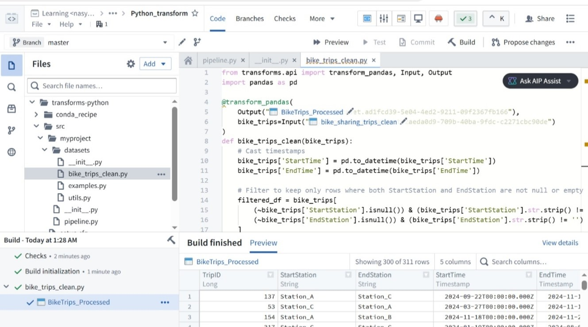
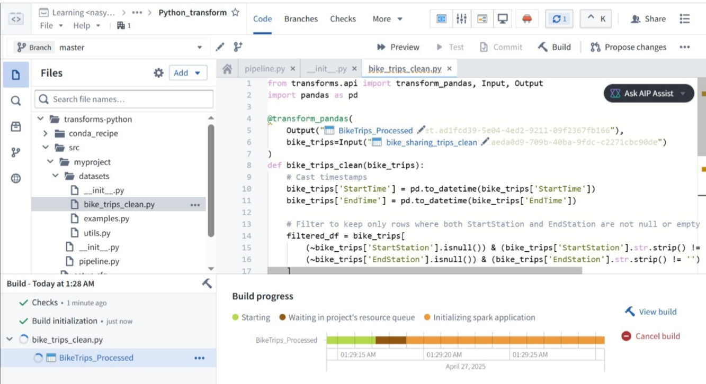
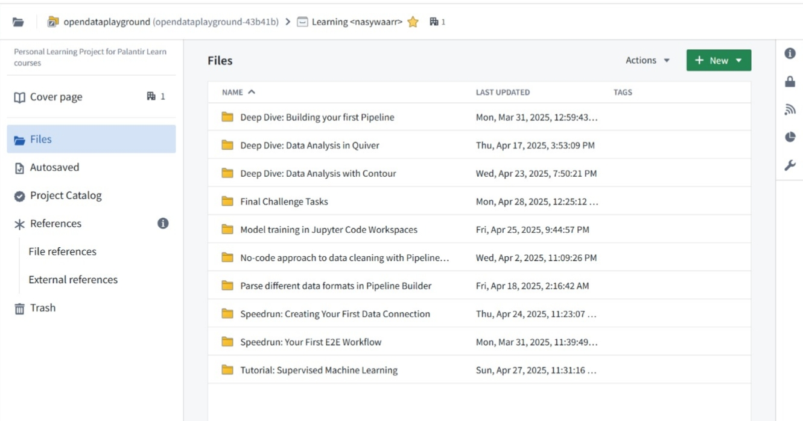

# 🛠️ Palantir Foundry — Learning & Prep

> Pre-hackathon preparation for **Hack4Future Sicily 2025**
> Platform: [Palantir AIP / Open Data Playground](https://www.palantir.com/platforms/foundry/)

---

## About

This repository documents my hands-on preparation with **Palantir Foundry** ahead of Hack4Future Sicily 2025 — an inter-university hackathon across Sicily focused on data-driven innovation.

Over ~4 weeks, I worked through 11 structured learning modules on the Open Data Playground, earned 7 Palantir certifications, and built multiple real pipelines covering data cleaning, feature engineering, REST API integration, and workflow debugging.

---

## Certifications

| Certificate | Completed |
|---|---|
| Introduction to Foundry & AIP for Enterprise Organizations | Feb 21, 2025 |
| Scoping Use Cases for Foundry & AIP | Feb 21, 2025 |
| Foundry & AIP Builder Foundations Quiz | Feb 22, 2025 |
| Deep Dive: Building Your First Pipeline | Mar 31, 2025 |
| Deep Dive: Creating Your First Data Connection | Apr 2, 2025 |
| Deep Dive: Data Analysis in Contour | Apr 16, 2025 |
| Deep Dive: Data Analysis in Quiver | Apr 17, 2025 |

---

## Modules Completed

| # | Module | Last Updated |
|---|--------|-------------|
| 1 | Speedrun: Your First E2E Workflow | Mar 31, 2025 |
| 2 | Deep Dive: Building your first Pipeline | Mar 31, 2025 |
| 3 | No-code approach to data cleaning with Pipeline Builder | Apr 2, 2025 |
| 4 | Deep Dive: Data Connection | Apr 2, 2025 |
| 5 | Deep Dive: Data Analysis in Quiver | Apr 17, 2025 |
| 6 | Parse different data formats in Pipeline Builder | Apr 18, 2025 |
| 7 | Deep Dive: Data Analysis with Contour | Apr 23, 2025 |
| 8 | Speedrun: Creating Your First Data Connection | Apr 24, 2025 |
| 9 | Model training in Jupyter Code Workspaces | Apr 25, 2025 |
| 10 | Tutorial: Supervised Machine Learning | Apr 27, 2025 |
| 11 | Final Challenge Tasks | Apr 28, 2025 |

---

### Example Build output

*Build completed successfully — 311 rows, 5 columns*

*Build progress: Starting → Spark → Running → Finished*

---

## Skills Practiced

- **Python Transforms** — `@transform_pandas`, Input/Output decorators, data cleaning and feature engineering
- **Pipeline Builder** — no-code filter transforms, graph-based pipeline construction, Python transform nodes
- **Quiver & Contour** — in-platform data analysis and visualization
- **Jupyter Code Workspaces** — supervised ML model training
- **Foundry data connections** — registering and managing datasets, REST API calls
- **Ontology Manager** — exploring object types, link types, and action types
- **Workshop** — building ontology-backed UI modules with pie chart widgets and object filters
- **End-to-end workflows** — raw data → clean dataset → feature engineering → analysis → output

---

## Screenshots

| Module Overview | Build in Progress | Build Succeeded |
|---|---|---|
|  |  |  |

> Screenshots taken from Palantir Open Data Playground (opendataplayground.palantirfoundry.com)

---

## Context

- 🏆 Built as prep for **[Hack4Future Sicily 2025]** — reached Top 4 Finalist
- 📍 University of Messina, CS student (Minor: Data Science)
- 🔗 [LinkedIn](https://linkedin.com/in/nasywaarr)

---

*Palantir Foundry and Open Data Playground are products of Palantir Technologies. This repo contains only my own learning work and does not reproduce any proprietary platform content.*
